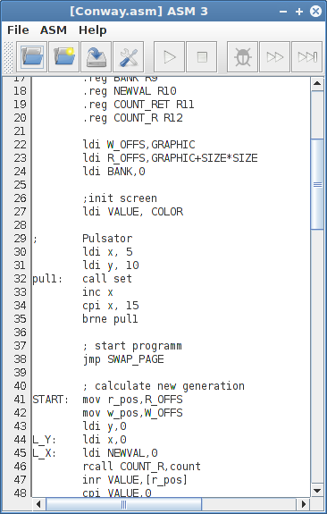

[Download latest Release](https://github.com/hneemann/Assembler/releases/latest)

The most recent changes are listed in the [release notes](distribution/ReleaseNotes.txt).

# ASM 3 #

In this repo you can find an assembler for a simulated 16 bit microprocessor which is realized as a 
[Digital](https://github.com/hneemann/Digital/) simulation. 
You can find the processor itself as one of the examples in the [Digital](https://github.com/hneemann/Digital/) repository
or in the distributed zip file.
The processor is a 16 bit harvard single cycle cpu and it is inspired by the MIPS architecture.
Only the handling of long constants is a bit of a hack to avoid a 32 bit instruction memory.   
The assembler supports pseudo instructions like *push*, *pop*, *enter*, *leave* or *call* and *ret [n]*. 
So it is also possible to program more like for a x86 cisc processor.  
The assembler has a simple GUI and is able to control the [simulator](https://github.com/hneemann/Digital/) by using its TCP/IP 
interface. So it is easy to debug an assembly program within the simulator. 

### Interfacing the Simulator ###

If you are interested in how to interface the simulator you can take a look at this 
[class](src/main/java/de/neemann/assembler/gui/RemoteInterface.java).
These are just a few lines of simple code, and it should be easy to translate it into any other language you want to use. 

### How it works ###

A list of the supported ASM instructions is included in the distributed zip file (`instructions.pdf`). 
If you are interested in modifying how the instructions are encoded, look at the file
[Opcode.java](https://github.com/hneemann/Assembler/blob/master/src/main/java/de/neemann/assembler/asm/Opcode.java).
The instructions and the associated flags used for the control unit are listed there.
Some instructions are available in two variants: The mnemonics with a lower case 's' attached, describes the instruction 
with a special encoding for a short constant, which can be included in the instruction itself.

### Usage ###

* In the folder *src/main/asm* are some sample programs in assembler. 
  The assembler creates a hex file to be loaded to the instruction memory of the simulated processor.
* You only need to start the simulator and load the example processor. Then you can control the simulator 
  by the assembler GUI.
* You can find the assembler in the folder *src/main/java*

### Set up? ###

* You can find the processor in the [Digital](https://github.com/hneemann/Digital/) repo or release ZIP as one of the examples.
* The assembler is implemented in Java and is build with maven. So you can build it calling `mvn install` on the command line.
* Most Java-IDE's are able to import the *pom.xml* file. Best maven support you can get using NetBeans.
